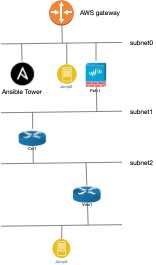

# **Ansible - AWS virtual Network Topology**

## **Overview**
This Ansible Playbook builds virtual networks on AWS Cloud. Real world WAN and security topologies are supported. 
It's very simple to add currently non-supported network devices. 

## **Features**
First a VPC with multiple subnets is created. 
Routers, Firewalls can have multiple interfaces in different subnets. 

### **Supported and tested devices**
##### **Routers**
* Cisco CSR 1000v
* Juniper vMX
##### **Firewalls**
* Palo Alto 
* Juniper vSRX
* Fortigate 
##### **Linux Servers**
* Ubuntu 18
* RHEL 7/8
* Centos 7
##### **Special Servers**
* Ansible Tower
* Gitlab Server (under constrution)


## **Usage**
 
* Provisioning AWS Cloud 
  ansible-playbook -i inventory/aws_rt3_wan.inv provision.yml     
* Post Installation Tasks 
  ansible-playbook -i lab.aws_ec2.yml post.yml 
* Teardown everything from AWS Cloud
  ansible-playbook -i inventory/aws_rt3_wan.inv -t teardown --skip-tags=always provision.yml 

## **Examples**

[simple WAN - 3 Cisco IOS Router](./docs/RT3_WAN.md)

### **Firewall and WAN**

. 

variables: 
```YAML
---
ec2_lab_count: 1

ec2_feature_server: true
ec2_feature_firewall: true
ec2_feature_router: true

ec2_linux_server:
  - name: tiny Jump3
    short: tj3
    instance_type: centos7
    network: 3
  - name: tiny Jump 0
    short: tj0
    instance_type: centos7
    public_ip: yes
    network: 0
  - "{{ ec2_linux_server_tower }}"

ec2_routers:
  - name: CSR 1000-1
    short: csr1
    instance_type: rt_cisco_csr
    public_ip: yes
    networks:
      - subnet: 0
        address: 172.16.0.100
      - subnet: 1
        address: 172.16.1.100
      - subnet: 2
        address: 172.16.2.100
  - name: JUNOS VMX 1
    short: vmx1
    instance_type: rt_junos_vmx
    public_ip: yes
    networks:
      - subnet: 0
        address: 172.16.0.101
      - subnet: 2
        address: 172.16.2.101
      - subnet: 3 
        address: 172.16.3.101

ec2_firewalls:
  - name: Palo 1
    short: palo1
    instance_type: fw_palo
    public_ip: yes
    networks:
      - subnet: 0
        address: 172.16.0.99
      - subnet: 1
        address: 172.16.1.99
```
* AWS VPC Topo:  


## **Prerequests**

* ansible >= 2.9
* boto3 >= 1.12
* genie, pyats >= 20.1 
* paramiko >= 2.7.1


