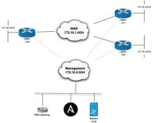

# **simple Cisco IOS Router WAN**

## **Overview**
Simple WAN Network Configurations with 3 Cisco IOS Routers (CSR 1000v).

## **Features**
### **Templates**
* IOS device facts
* Interface configuration (description, admin status)
* L3 IPv4 configuration
* BGP configuration (WAN)
* Testing, verification and rollbacks
* parsing 'show command' outputs to structured data

### **Ansible Modules involved**
* ios_facts
* ios_bgp 
* ios_interfaces (resource module)
* ios_l3_interfaces (resource module)

## **Usage**
#### **Create**
* ansible-playbook -i localhost.inv ex_rt3.yml
* ansible-playbook -i lab.aws_ec2.yml post.yml 
#### **Teardown**
* ansible-playbook -i localhost.inv -t teardown --skip-tags=always ex_rt3.yml

## **Topology**

## **Configuration**
[default](../examples/aws_rt3.yml)

## **Prerequests**
* AWS Account 
* Subscription for IOS CSR 1000v BYOL 
* Subscription for RHEL BYOL
* Subscription for CentOS

pip:
* ansible > 2.9             
* ansible-tower-cli  
* boto3
* botocore

## **open caveats**
* workflow template
* pyATS BGP verification
* backup device template
